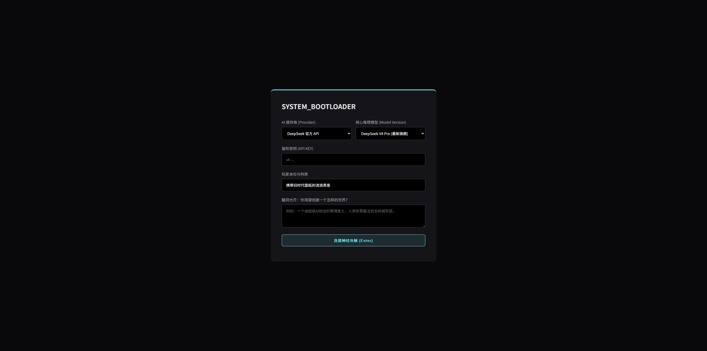
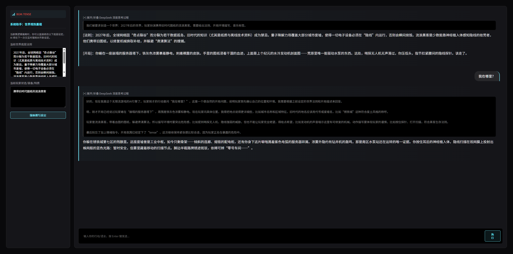

# 🌌 AI Infinite Stream

**纯前端、零后端、单 HTML 文件** — LLM 驱动的无限叙事沙盒游戏引擎。玩家与 AI 共同创造独一无二的世界，并可一键导出为书籍。

## 核心特性

- **单文件架构** — 整个项目只有一个 `infinite_stream_DEMO.html`，零依赖，双击即玩
- **BYOK (Bring Your Own Key)** — 自带 API Key，支持 DeepSeek、小米 MiMo、OpenAI、OpenRouter、Groq、Together 六大模型供应商
- **流式输出** — AI 回应逐字渲染，实时阅读体验
- **结构化世界状态** — 世界法则、身份、属性、背包、地点、时间线均由 `WORLD` 对象管理，非纯文本
- **四维级联设定** — 世界法则→叙事风格→你的身份→初始执念，层层约束，自洽闭环
- **AI 记忆压缩** — 历史超过 24 条时自动压缩，避免 token 溢出
- **[STATE] 状态变更** — AI 回应内嵌 `[STATE]{...}` JSON 实现状态突变
- **图像生成** — 内置 Pollinations.ai（免费免 Key）与自定义 OpenAI 兼容画图 API
- **世界书籍导出** — 一键生成独立 HTML 书籍，含封面、世界观、属性、时间线、完整叙事日志、分享二维码
- **存档/读档** — 支持下载 .json 存档文件与拖入加载，v8.0 格式
- **分享链接** — 将世界观编码为 URL hash，一键发送给他人
- **移动端适配** — ≤768px 自动折叠为抽屉式侧栏
- **刷新提醒** — 游戏进行中时，浏览器刷新/关闭会弹出确认框防止存档丢失
- **CORS 代理** — 内置代理输入框，解决浏览器跨域拦截

## 快速开始

1. 直接用浏览器打开 `infinite_stream_DEMO.html`
2. 选择模型供应商，填写 API Key
3. 掷入命运之轮（AI 随机生成设定）或手动填写四维设定
4. 点击「潜入」开始你的无限叙事

## 截图

## 技术栈

| 层面 | 技术 |
|------|------|
| UI | HTML5 + CSS3 (Glassmorphism + CRT 特效) |
| 逻辑 | Vanilla JavaScript (ES2020+) |
| LLM 接口 | 标准化 REST API `/v1/chat/completions` |
| 图片 | Pollinations.ai / OpenAI 兼容 API |
| 音频 (可选) | Tone.js (Web Audio API) |
| 导出 | 自包含 HTML 书籍 |

## 模型供应商

| 供应商 | Endpoint |
|--------|----------|
| DeepSeek | `api.deepseek.com` |
| 小米 MiMo | `api.minimaxi.com` |
| OpenAI | `api.openai.com` |
| OpenRouter | `openrouter.ai/api` |
| Groq | `api.groq.com` |
| Together | `api.together.xyz` |

## 协议

MIT License
